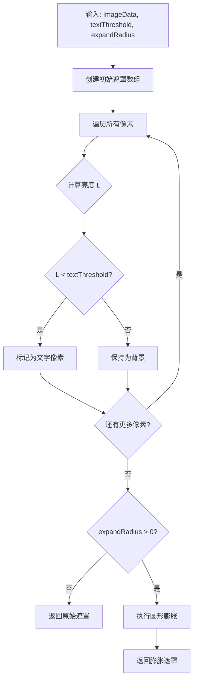
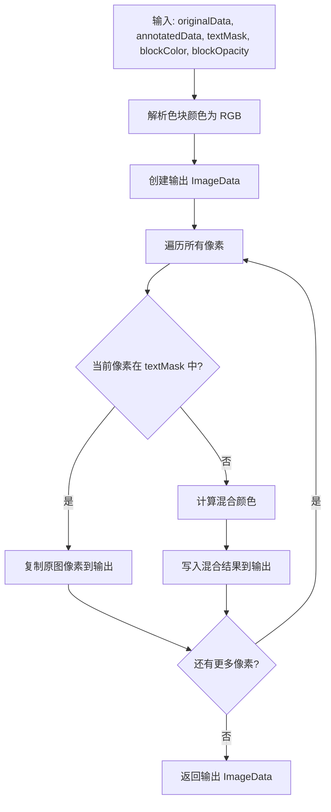
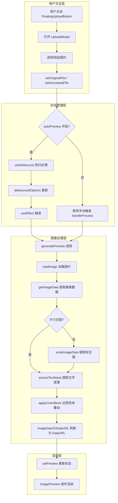
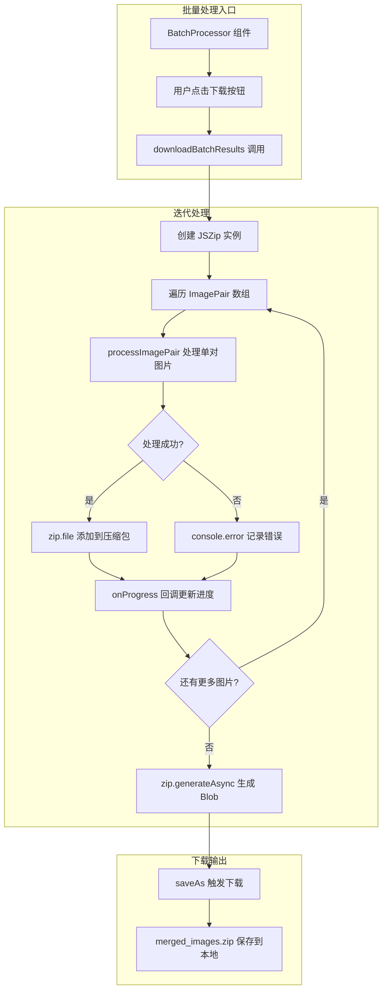
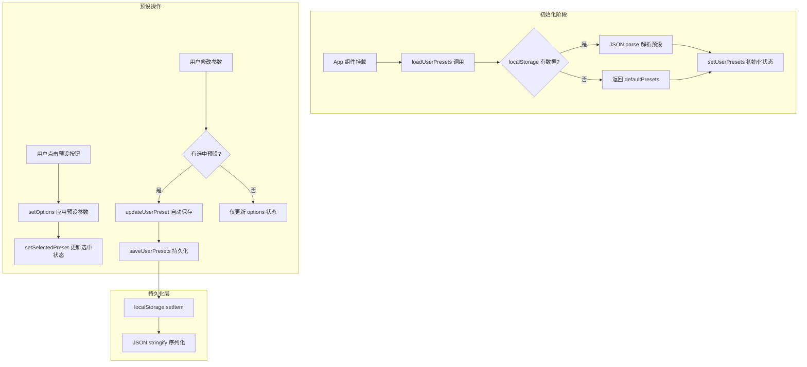
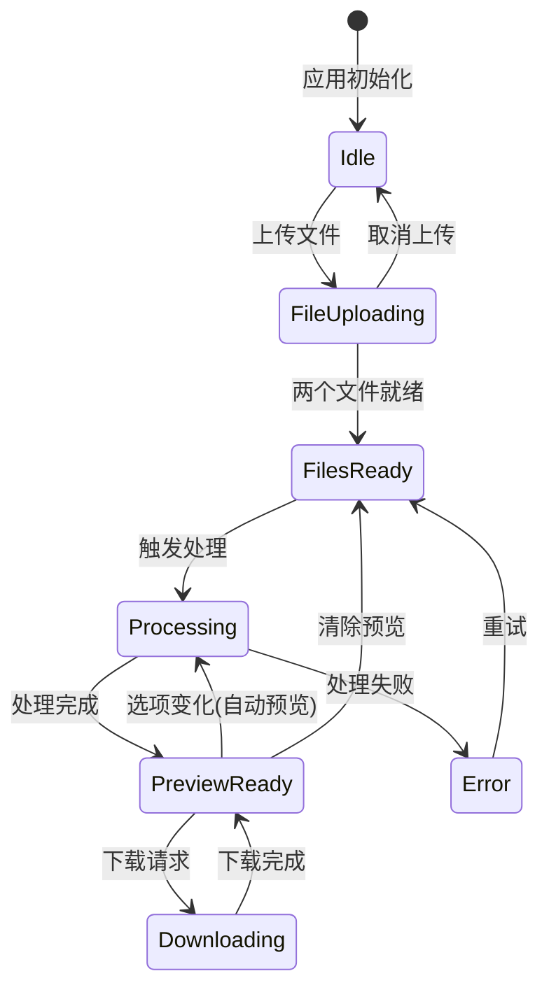
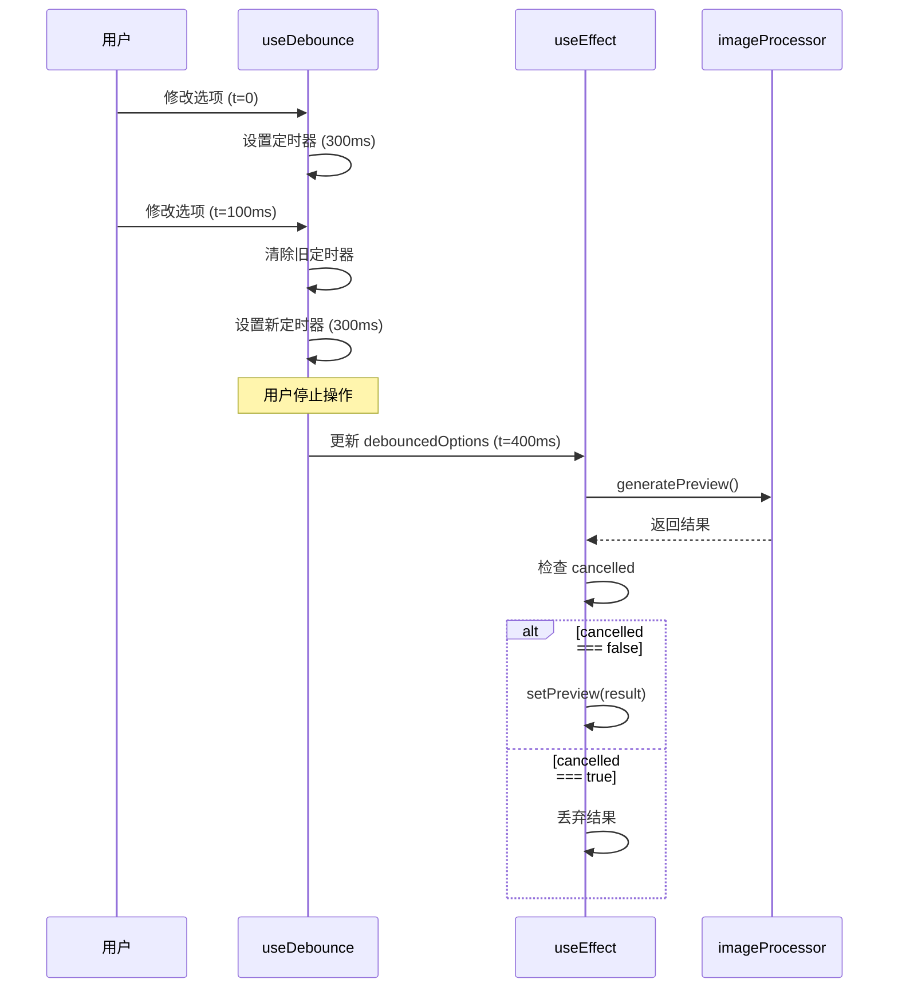
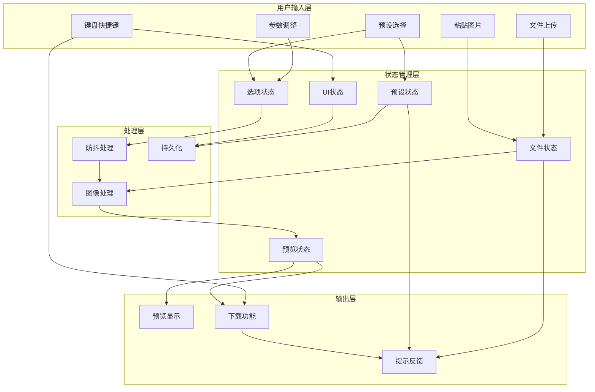

# 笔记图片叠加工具 - 实现原理与流程分析报告

> **报告类型**: Methods Analysis (方法分析)  
> **分析深度**: Detailed (详细)  
> **生成时间**: 2026-02-01

---

## 执行摘要

本报告对笔记图片叠加工具的实现原理和处理流程进行全面分析。该应用是一个基于 React 的 Web 应用，核心功能是将 AI 标注图片与原始笔记图片进行智能合成，实现"文字区域保持清晰、非文字区域叠加半透明色块"的视觉效果。

**核心技术栈**：
- 前端框架：React 19 + TypeScript
- 构建工具：Vite 6
- 样式方案：Tailwind CSS 4
- 图像处理：Canvas API (纯前端实现)
- 文件处理：JSZip + FileSaver

**关键实现特点**：
1. 基于 ITU-R BT.601 亮度公式的文字检测算法
2. 圆形膨胀的遮罩扩展机制
3. Alpha 混合的色块叠加效果
4. 300ms 防抖的实时预览机制
5. localStorage 持久化的预设管理系统

---

## 目录

1. [核心算法分析](#1-核心算法分析)
2. [关键代码路径](#2-关键代码路径)
3. [复杂逻辑分析](#3-复杂逻辑分析)
4. [公共 API 参考](#4-公共-api-参考)
5. [系统架构总览](#5-系统架构总览)

---

## 1. 核心算法分析

### 1.1 文字检测算法 (`extractTextMask`)

文字检测算法基于一个关键观察：在典型的笔记图片中，文字通常呈现为深色（黑色或深灰色）笔迹，而背景则为浅色（白色或米色）纸张。因此，通过计算每个像素的亮度值并与预设阈值比较，可以有效地将文字区域从背景中分离出来。

该算法采用两阶段处理策略：首先通过亮度阈值进行初步的文字像素识别，然后通过形态学膨胀操作扩展检测区域，确保文字笔画的完整覆盖。

#### 亮度计算公式

亮度计算采用 ITU-R BT.601 标准的加权公式，该公式考虑了人眼对不同颜色通道的敏感度差异：

$$L = 0.299 \times R + 0.587 \times G + 0.114 \times B$$

其中 $L$ 为计算得到的亮度值（范围 0-255），$R$、$G$、$B$ 分别为像素的红、绿、蓝通道值。绿色通道权重最高（0.587）反映了人眼对绿色光最为敏感的生理特性。

```typescript
function getLuminance(r: number, g: number, b: number): number {
  return 0.299 * r + 0.587 * g + 0.114 * b;
}
```

#### 圆形膨胀算法

初步检测得到的文字遮罩往往存在边缘不完整的问题。为解决这一问题，算法实现了基于欧几里得距离的圆形膨胀操作。

膨胀操作的核心思想是：对于每个已标记为文字的像素，将其周围一定半径内的所有像素也标记为文字区域。距离判断条件 `dx² + dy² ≤ r²` 实现了标准的欧几里得距离检验，确保只有与中心像素距离不超过 `expandRadius` 的像素才会被纳入膨胀区域。



### 1.2 色块叠加算法 (`applyColorBlock`)

色块叠加算法实现了图像合成的核心逻辑，其目标是生成一张融合了原图清晰度与标注图视觉效果的最终图像。算法根据文字遮罩对每个像素进行差异化处理。

#### 像素混合公式

对于非文字区域的像素，算法采用标准的 Alpha 混合（Alpha Blending）公式进行颜色合成：

$$C_{out} = C_{annotated} \times (1 - \alpha) + C_{block} \times \alpha$$

其中：
- $C_{out}$ 为输出像素的颜色值
- $C_{annotated}$ 为标注图对应像素的颜色值
- $C_{block}$ 为用户配置的色块颜色
- $\alpha$ 为色块透明度（`blockOpacity`，范围 0-1）

#### 处理差异

| 区域类型 | 处理方式 | 目的 |
|---------|---------|------|
| 文字区域 | 直接复制原图像素 | 保持文字清晰度 |
| 非文字区域 | 标注图 + 色块混合 | 突出标注效果 |



### 1.3 图像缩放算法 (`scaleImageData`)

图像缩放算法解决了原图与标注图尺寸不一致的问题。算法利用 HTML5 Canvas API 的内置缩放能力实现图像重采样。Canvas 的 `drawImage` 方法在绘制时会自动进行双线性插值（Bilinear Interpolation），能够在放大和缩小时都产生相对平滑的结果。

### 1.4 算法复杂度分析

| 算法 | 时间复杂度 | 空间复杂度 | 说明 |
|------|-----------|-----------|------|
| `getLuminance` | O(1) | O(1) | 常数时间的数学运算 |
| `extractTextMask` (无膨胀) | O(n) | O(n) | n 为像素总数 |
| `extractTextMask` (有膨胀) | O(n × r²) | O(n) | r 为膨胀半径 |
| `applyColorBlock` | O(n) | O(n) | 线性遍历所有像素 |
| `scaleImageData` | O(n + m) | O(n + m) | n 为源像素数，m 为目标像素数 |
| `processImagePair` | O(n × r²) | O(n) | 受膨胀操作主导 |

---

## 2. 关键代码路径

### 2.1 单张处理流程

单张处理流程是应用的核心功能路径，涵盖从用户上传图片到最终预览显示的完整生命周期。该流程采用响应式设计，支持实时预览与手动处理两种模式，并通过防抖机制优化性能。



#### generatePreview 函数详解

`generatePreview` 函数位于 `src/utils/imageProcessor.ts` 第 468-523 行，是单张处理的核心入口。该函数接收原始图片文件、标注图片文件和处理选项三个参数，返回包含五个 DataURL 的对象：

| 返回字段 | 说明 |
|---------|------|
| `original` | 原始图片的 Data URL |
| `annotated` | 缩放后标注图的 Data URL |
| `annotationLayer` | 文字遮罩预览（红色半透明标记文字区域） |
| `annotatedWithBlock` | 标注图 + 色块叠加的中间状态 |
| `result` | 最终合成结果 |

### 2.2 批量处理流程

批量处理流程允许用户同时处理多对图片，并将结果打包为 ZIP 文件下载。该流程由 `BatchProcessor` 组件协调，核心逻辑位于 `fileUtils.ts` 的 `downloadBatchResults` 函数。



### 2.3 预设管理流程

预设管理系统允许用户保存、加载、更新和删除自定义处理参数配置。系统支持最多 4 个预设，并提供恢复默认预设功能。所有预设数据通过 localStorage 持久化存储。



---

## 3. 复杂逻辑分析

### 3.1 状态管理逻辑

应用的状态管理呈现出典型的"星型拓扑"结构，以 `App.tsx` 作为状态中枢，协调多个相互关联的状态变量。

#### 核心状态

| 状态变量 | 类型 | 用途 |
|---------|------|------|
| `originalFile` | `File \| null` | 原始图片文件 |
| `annotatedFile` | `File \| null` | 标注图片文件 |
| `options` | `ProcessingOptions` | 当前处理选项 |
| `userPresets` | `Preset[]` | 用户预设列表 |
| `selectedPreset` | `string \| null` | 当前选中预设 ID |
| `preview` | `object \| null` | 预览结果（5 个 DataURL） |

#### 状态流转图



### 3.2 响应式设计逻辑

`useScreenSize` 钩子采用 CSS Media Query API 实现屏幕尺寸检测，定义了三个断点：

| 断点 | 宽度范围 | 侧边栏行为 |
|------|---------|-----------|
| mobile | < 768px | 自动折叠 |
| tablet | 768px - 1024px | 自动折叠，支持覆盖层展开 |
| desktop | >= 1024px | 默认展开 |

该实现的关键设计决策是使用 `matchMedia` 而非 `resize` 事件监听，这带来了显著的性能优势——浏览器仅在断点边界触发回调，而非每次窗口尺寸变化都执行。

#### 用户意图追踪

侧边栏的折叠行为涉及"系统触发"与"用户触发"的区分。当屏幕尺寸从 desktop 切换到 tablet/mobile 时，系统应自动折叠侧边栏；但如果用户刚刚手动展开了侧边栏，则不应覆盖用户的意图。

```typescript
const userToggledSidebar = useRef(false);

useEffect(() => {
  if (userToggledSidebar.current) {
    userToggledSidebar.current = false;
    return;
  }
  if (screenSize === 'mobile' || screenSize === 'tablet') {
    setSidebarCollapsed(true);
  }
}, [screenSize]);
```

### 3.3 实时预览逻辑

#### useDebounce Hook 防抖机制

实时预览功能的核心挑战是平衡响应速度与计算资源消耗。`useDebounce` 钩子通过延迟执行策略解决这一问题。

```typescript
function useDebounce<T>(value: T, delay: number): T {
  const [debouncedValue, setDebouncedValue] = useState<T>(value);

  useEffect(() => {
    const timer = setTimeout(() => setDebouncedValue(value), delay);
    return () => clearTimeout(timer);
  }, [value, delay]);

  return debouncedValue;
}

// 使用：300ms 防抖延迟
const debouncedOptions = useDebounce(options, 300);
```

#### 竞态条件处理

异步操作的竞态条件是 React 应用中的常见陷阱。当用户快速连续修改参数时，可能出现后发起的请求先完成的情况。`cancelled` 标志变量配合清理函数，确保只有最新的处理结果会更新状态。



### 3.4 全局事件处理

#### 粘贴事件的智能填充逻辑

粘贴功能实现了"智能槽位填充"策略：系统根据当前文件状态自动决定粘贴图片的目标位置。

| 当前状态 | 粘贴行为 | 提示信息 |
|---------|---------|---------|
| 无原图 | 填充为原图 | "已粘贴为原始图片" |
| 有原图，无标注图 | 填充为标注图 | "已粘贴为 AI 标注图片" |
| 两者都有 | 替换原图 | "已替换原始图片" |

#### 键盘快捷键

| 快捷键 | 功能 | 条件 |
|-------|------|------|
| Ctrl+S | 下载结果 | 有预览结果 |
| Space | 切换对比视图 | 有预览结果，非输入框焦点 |
| Escape | 关闭覆盖层 | 覆盖层可见 |

---

## 4. 公共 API 参考

### 4.1 类型定义

#### ProcessingOptions

```typescript
interface ProcessingOptions {
  textThreshold: number;  // 文字检测亮度阈值 (0-255)
  maskExpand: number;     // 遮罩膨胀半径 (像素)
  blockColor: string;     // 色块颜色 (CSS HEX)
  blockOpacity: number;   // 色块透明度 (0-1)
}
```

#### Preset

```typescript
interface Preset {
  id: string;             // 预设唯一标识符
  name: string;           // 预设显示名称
  description: string;    // 预设描述文本
  options: ProcessingOptions;
}
```

#### ImagePair

```typescript
interface ImagePair {
  id: string;             // 图像对唯一标识符
  originalFile: File;     // 原始图片文件
  annotatedFile: File;    // 标注图片文件
  originalName: string;   // 原始文件名
}
```

### 4.2 图像处理 API

| 函数 | 签名 | 说明 |
|------|------|------|
| `processImagePair` | `(original, annotated, options?) => Promise<Blob>` | 主处理函数，返回 PNG Blob |
| `generatePreview` | `(original, annotated, options?) => Promise<PreviewResult>` | 生成预览 DataURL |
| `loadImage` | `(file: File) => Promise<HTMLImageElement>` | 加载图片文件 |
| `getImageData` | `(img: HTMLImageElement) => ImageData` | 提取像素数据 |
| `imageDataToBlob` | `(data: ImageData, type?) => Promise<Blob>` | 转换为 Blob |
| `imageDataToDataURL` | `(data: ImageData) => string` | 转换为 DataURL |

### 4.3 预设管理 API

| 函数 | 签名 | 说明 |
|------|------|------|
| `loadUserPresets` | `() => Preset[]` | 从 localStorage 加载预设 |
| `saveUserPresets` | `(presets: Preset[]) => void` | 保存预设到 localStorage |
| `addUserPreset` | `(name, options, existing) => Preset[]` | 添加新预设 |
| `removeUserPreset` | `(id, existing) => Preset[]` | 删除预设 |
| `updateUserPreset` | `(id, options, existing) => Preset[]` | 更新预设选项 |
| `resetToDefaultPresets` | `() => Preset[]` | 恢复默认预设 |

### 4.4 文件工具 API

| 函数 | 签名 | 说明 |
|------|------|------|
| `downloadSingleResult` | `(original, annotated, options?) => Promise<void>` | 单文件下载 |
| `downloadBatchResults` | `(pairs, options?, onProgress?) => Promise<void>` | 批量打包下载 |
| `isImageFile` | `(file: File) => boolean` | 验证图片类型 |
| `formatFileSize` | `(bytes: number) => string` | 格式化文件大小 |
| `generateId` | `() => string` | 生成唯一 ID |
| `getBaseName` | `(filename: string) => string` | 提取文件基础名 |
| `getExtension` | `(filename: string) => string` | 提取扩展名 |

---

## 5. 系统架构总览

### 5.1 数据流图



### 5.2 文件位置索引

| 功能模块 | 文件路径 | 行号范围 |
|----------|----------|----------|
| 主应用组件 | `src/App.tsx` | 1-871 |
| useDebounce Hook | `src/App.tsx` | 94-103 |
| 实时预览 Effect | `src/App.tsx` | 312-344 |
| 预设管理回调 | `src/App.tsx` | 175-203 |
| 图像处理核心 | `src/utils/imageProcessor.ts` | 1-524 |
| generatePreview | `src/utils/imageProcessor.ts` | 468-523 |
| extractTextMask | `src/utils/imageProcessor.ts` | 178-226 |
| applyColorBlock | `src/utils/imageProcessor.ts` | 233-269 |
| 预设管理函数 | `src/utils/imageProcessor.ts` | 90-138 |
| 文件工具 | `src/utils/fileUtils.ts` | 1-91 |
| downloadBatchResults | `src/utils/fileUtils.ts` | 50-72 |

### 5.3 参数调优建议

#### textThreshold (文字检测阈值)

| 值范围 | 适用场景 |
|-------|---------|
| 150-180 | 高对比度打印文档，仅检测深色笔迹 |
| 180-210 | 大多数手写笔记（推荐） |
| 210-240 | 铅笔书写或低对比度扫描件 |

#### maskExpand (遮罩膨胀半径)

| 值范围 | 适用场景 |
|-------|---------|
| 0-1 像素 | 细体字或高分辨率图片 |
| 2-3 像素 | 常规笔记（推荐） |
| 4-5 像素 | 粗体字或需要更大保护区域 |

#### blockOpacity (色块透明度)

| 值范围 | 效果 |
|-------|------|
| 0.2-0.3 | 轻度叠加，标注内容仍清晰可见 |
| 0.3-0.5 | 中度叠加，明显的高亮效果（推荐） |
| 0.5-0.7 | 重度叠加，强烈的视觉标记 |

---

## 附录：默认预设配置

| 预设名称 | 色块颜色 | 透明度 | 阈值 | 膨胀半径 |
|---------|---------|-------|------|---------|
| 黄色高亮 | #FFFF00 | 0.30 | 200 | 2 |
| 绿色高亮 | #90EE90 | 0.35 | 200 | 2 |
| 粉色高亮 | #FFB6C1 | 0.35 | 200 | 2 |
| 蓝色高亮 | #87CEEB | 0.30 | 200 | 2 |

---

*报告生成时间: 2026-02-01*  
*分析范围: src/App.tsx (871 行), src/utils/imageProcessor.ts (524 行), src/utils/fileUtils.ts (91 行)*
