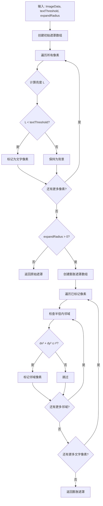
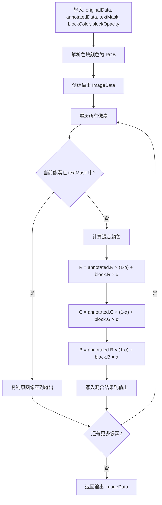
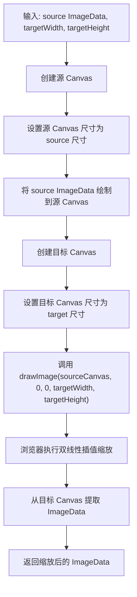
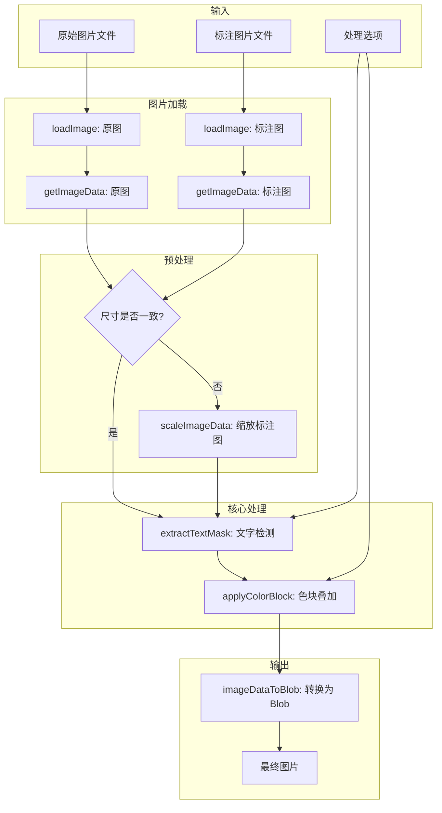

# 核心算法分析报告

## 概述

本项目实现了一套基于亮度阈值的文字区域检测与色块叠加算法，用于将 AI 标注图片与原始笔记图片进行智能合成。核心设计理念是"反向遮罩叠加"——在检测到的文字区域保持原图清晰度，而在非文字区域叠加半透明色块以突出标注内容。

---

## 1. 文字检测算法 (`extractTextMask`)

### 1.1 算法原理

文字检测算法基于一个关键观察：在典型的笔记图片中，文字通常呈现为深色（黑色或深灰色）笔迹，而背景则为浅色（白色或米色）纸张。因此，通过计算每个像素的亮度值并与预设阈值比较，可以有效地将文字区域从背景中分离出来。

该算法采用两阶段处理策略：首先通过亮度阈值进行初步的文字像素识别，然后通过形态学膨胀操作扩展检测区域，确保文字笔画的完整覆盖。

### 1.2 亮度计算公式

亮度计算采用 ITU-R BT.601 标准的加权公式，该公式考虑了人眼对不同颜色通道的敏感度差异：

$$L = 0.299 \times R + 0.587 \times G + 0.114 \times B$$

其中 $L$ 为计算得到的亮度值（范围 0-255），$R$、$G$、$B$ 分别为像素的红、绿、蓝通道值。绿色通道权重最高（0.587）反映了人眼对绿色光最为敏感的生理特性；红色次之（0.299）；蓝色最低（0.114）。

```typescript
function getLuminance(r: number, g: number, b: number): number {
  return 0.299 * r + 0.587 * g + 0.114 * b;
}
```

### 1.3 阈值判断逻辑

算法遍历图像的每个像素，计算其亮度值并与用户配置的 `textThreshold` 参数进行比较。当像素亮度低于阈值时，该像素被标记为文字区域。默认阈值设置为 200，这意味着亮度值在 0-199 范围内的像素（较暗的像素）将被识别为文字。

```typescript
// 第一步：检测暗色像素（文字）
for (let y = 0; y < height; y++) {
  for (let x = 0; x < width; x++) {
    const idx = (y * width + x) * 4;
    const luminance = getLuminance(data[idx], data[idx + 1], data[idx + 2]);
    
    // 亮度低于阈值的像素被视为文字
    if (luminance < textThreshold) {
      mask[y * width + x] = true;
    }
  }
}
```

阈值的选择直接影响检测的敏感度：较低的阈值（如 150）仅检测非常深的笔迹，适用于高对比度文档；较高的阈值（如 220）则会将浅灰色内容也纳入文字区域，适用于铅笔书写或扫描质量较低的图片。

### 1.4 圆形膨胀算法

初步检测得到的文字遮罩往往存在边缘不完整的问题——文字笔画的边缘像素可能因为抗锯齿处理而亮度较高，从而未被正确识别。为解决这一问题，算法实现了基于欧几里得距离的圆形膨胀操作。

膨胀操作的核心思想是：对于每个已标记为文字的像素，将其周围一定半径内的所有像素也标记为文字区域。采用圆形而非方形膨胀的原因在于，圆形膨胀能够产生更自然、更均匀的边缘扩展效果，避免方形膨胀在对角方向上过度扩展的问题。

```typescript
// 第二步：圆形膨胀遮罩（扩展文字区域）
if (expandRadius > 0) {
  const expandedMask = new Array<boolean>(width * height).fill(false);
  
  for (let y = 0; y < height; y++) {
    for (let x = 0; x < width; x++) {
      if (mask[y * width + x]) {
        for (let dy = -expandRadius; dy <= expandRadius; dy++) {
          for (let dx = -expandRadius; dx <= expandRadius; dx++) {
            const nx = x + dx;
            const ny = y + dy;
            
            if (nx >= 0 && nx < width && ny >= 0 && ny < height) {
              // 欧几里得距离判断：dx² + dy² ≤ r²
              if (dx * dx + dy * dy <= expandRadius * expandRadius) {
                expandedMask[ny * width + nx] = true;
              }
            }
          }
        }
      }
    }
  }
  return expandedMask;
}
```

距离判断条件 `dx * dx + dy * dy <= expandRadius * expandRadius` 实现了标准的欧几里得距离检验，确保只有与中心像素距离不超过 `expandRadius` 的像素才会被纳入膨胀区域。这一实现避免了开方运算，通过比较距离的平方值来提升计算效率。

### 1.5 算法流程图



---

## 2. 色块叠加算法 (`applyColorBlock`)

### 2.1 算法原理

色块叠加算法实现了图像合成的核心逻辑，其目标是生成一张融合了原图清晰度与标注图视觉效果的最终图像。算法根据文字遮罩对每个像素进行差异化处理：文字区域直接使用原图像素以保持清晰度；非文字区域则在标注图基础上叠加半透明色块以突出标注内容。

### 2.2 像素混合公式

对于非文字区域的像素，算法采用标准的 Alpha 混合（Alpha Blending）公式进行颜色合成：

$$C_{out} = C_{annotated} \times (1 - \alpha) + C_{block} \times \alpha$$

其中：
- $C_{out}$ 为输出像素的颜色值
- $C_{annotated}$ 为标注图对应像素的颜色值
- $C_{block}$ 为用户配置的色块颜色
- $\alpha$ 为色块透明度（`blockOpacity`，范围 0-1）

该公式对 RGB 三个通道分别独立计算，确保颜色混合的正确性。当 $\alpha = 0$ 时，输出完全等于标注图；当 $\alpha = 1$ 时，输出完全等于色块颜色。默认透明度 0.3 提供了适中的视觉效果，既能清晰显示色块标记，又不会过度遮挡原有内容。

```typescript
// 非文字区域：在标注图上叠加色块
output[idx] = Math.round(annotated[idx] * (1 - blockOpacity) + color.r * blockOpacity);
output[idx + 1] = Math.round(annotated[idx + 1] * (1 - blockOpacity) + color.g * blockOpacity);
output[idx + 2] = Math.round(annotated[idx + 2] * (1 - blockOpacity) + color.b * blockOpacity);
output[idx + 3] = 255; // Alpha 通道固定为完全不透明
```

### 2.3 文字区域与非文字区域的处理差异

算法的核心设计在于对两类区域的差异化处理策略：

**文字区域处理**：直接复制原图（`originalData`）的像素值到输出图像，不进行任何混合或修改。这确保了文字内容的完整清晰度，避免色块叠加导致的可读性下降。

```typescript
if (textMask[maskIdx]) {
  // 文字区域：使用清晰原图
  output[idx] = original[idx];
  output[idx + 1] = original[idx + 1];
  output[idx + 2] = original[idx + 2];
  output[idx + 3] = 255;
}
```

**非文字区域处理**：使用标注图（`annotatedData`）作为基底，叠加用户配置的半透明色块。标注图通常是 AI 处理后的版本，可能包含模糊效果或其他视觉增强，色块叠加进一步强化了标注区域的视觉识别度。

### 2.4 颜色解析

算法支持两种 HEX 颜色格式的解析：三位简写格式（如 `#F00`）和六位完整格式（如 `#FF0000`）。解析函数将 CSS 颜色字符串转换为 RGB 对象，供混合计算使用。

```typescript
function parseColor(color: string): { r: number; g: number; b: number } {
  const hex = color.replace('#', '');
  
  if (/^[0-9a-fA-F]{3}$/.test(hex)) {
    // 三位格式：#RGB -> #RRGGBB
    return {
      r: parseInt(hex[0] + hex[0], 16),
      g: parseInt(hex[1] + hex[1], 16),
      b: parseInt(hex[2] + hex[2], 16),
    };
  }
  
  if (/^[0-9a-fA-F]{6}$/.test(hex)) {
    // 六位格式：#RRGGBB
    return {
      r: parseInt(hex.slice(0, 2), 16),
      g: parseInt(hex.slice(2, 4), 16),
      b: parseInt(hex.slice(4, 6), 16),
    };
  }
  
  // 默认返回黄色
  return { r: 255, g: 255, b: 0 };
}
```

### 2.5 算法流程图



---

## 3. 图像缩放算法 (`scaleImageData`)

### 3.1 算法原理

图像缩放算法解决了原图与标注图尺寸不一致的问题。由于两张图片可能来自不同的处理流程或设备，其分辨率可能存在差异。为确保像素级操作的正确对齐，算法在处理前将标注图缩放至与原图相同的尺寸。

### 3.2 Canvas 缩放原理

算法利用 HTML5 Canvas API 的内置缩放能力实现图像重采样。Canvas 的 `drawImage` 方法在绘制时会自动进行双线性插值（Bilinear Interpolation），这是浏览器默认的图像缩放算法，能够在放大和缩小时都产生相对平滑的结果。

实现过程分为三个步骤：首先将源 `ImageData` 绘制到一个临时 Canvas 上；然后创建目标尺寸的 Canvas，并使用 `drawImage` 将源 Canvas 内容缩放绘制到目标 Canvas；最后从目标 Canvas 提取缩放后的 `ImageData`。

```typescript
function scaleImageData(source: ImageData, targetWidth: number, targetHeight: number): ImageData {
  // 步骤1：将源 ImageData 绘制到临时 Canvas
  const sourceCanvas = document.createElement('canvas');
  sourceCanvas.width = source.width;
  sourceCanvas.height = source.height;
  const sourceCtx = sourceCanvas.getContext('2d')!;
  sourceCtx.putImageData(source, 0, 0);
  
  // 步骤2：创建目标 Canvas 并缩放绘制
  const targetCanvas = document.createElement('canvas');
  targetCanvas.width = targetWidth;
  targetCanvas.height = targetHeight;
  const targetCtx = targetCanvas.getContext('2d')!;
  targetCtx.drawImage(sourceCanvas, 0, 0, targetWidth, targetHeight);
  
  // 步骤3：提取缩放后的 ImageData
  return targetCtx.getImageData(0, 0, targetWidth, targetHeight);
}
```

### 3.3 缩放质量考量

Canvas 的默认缩放算法在大多数场景下表现良好，但存在以下特性需要注意：

1. **缩小操作**：当目标尺寸小于源尺寸时，浏览器会进行下采样，可能导致细节丢失。对于包含细小文字的图片，过度缩小可能影响后续的文字检测准确性。

2. **放大操作**：当目标尺寸大于源尺寸时，双线性插值会产生一定程度的模糊效果。这对于标注图来说通常是可接受的，因为标注图本身可能已经过模糊处理。

3. **性能影响**：Canvas 缩放操作在 GPU 加速的浏览器中执行效率较高，但对于超大尺寸图片仍可能产生明显的处理延迟。

### 3.4 算法流程图



---

## 4. 完整处理流程

### 4.1 主处理函数 (`processImagePair`)

主处理函数整合了上述所有算法，实现了从文件输入到 Blob 输出的完整处理流程：

```typescript
export async function processImagePair(
  originalFile: File,
  annotatedFile: File,
  options: ProcessingOptions = defaultProcessingOptions
): Promise<Blob> {
  // 1. 并行加载两张图片
  const [originalImg, annotatedImg] = await Promise.all([
    loadImage(originalFile),
    loadImage(annotatedFile),
  ]);
  
  // 2. 获取图片像素数据
  const originalData = getImageData(originalImg);
  const annotatedData = getImageData(annotatedImg);
  
  // 3. 尺寸对齐：如有必要，缩放标注图
  let scaledAnnotatedData = annotatedData;
  if (originalImg.width !== annotatedImg.width || originalImg.height !== annotatedImg.height) {
    scaledAnnotatedData = scaleImageData(annotatedData, originalData.width, originalData.height);
  }
  
  // 4. 提取文字遮罩
  const textMask = extractTextMask(
    originalData,
    options.textThreshold,
    options.maskExpand
  );
  
  // 5. 应用色块叠加
  const resultData = applyColorBlock(
    originalData,
    scaledAnnotatedData,
    textMask,
    options.blockColor,
    options.blockOpacity
  );
  
  // 6. 转换为 Blob 输出
  return imageDataToBlob(resultData);
}
```

### 4.2 端到端流程图



---

## 5. 算法复杂度分析

| 算法 | 时间复杂度 | 空间复杂度 | 说明 |
|------|-----------|-----------|------|
| `getLuminance` | O(1) | O(1) | 常数时间的数学运算 |
| `extractTextMask` (无膨胀) | O(n) | O(n) | n 为像素总数 |
| `extractTextMask` (有膨胀) | O(n × r²) | O(n) | r 为膨胀半径 |
| `applyColorBlock` | O(n) | O(n) | 线性遍历所有像素 |
| `scaleImageData` | O(n + m) | O(n + m) | n 为源像素数，m 为目标像素数 |
| `processImagePair` | O(n × r²) | O(n) | 受膨胀操作主导 |

---

## 6. 参数调优建议

### 6.1 `textThreshold` (文字检测阈值)

- **较低值 (150-180)**：仅检测深色笔迹，适用于高对比度打印文档
- **中等值 (180-210)**：平衡检测，适用于大多数手写笔记
- **较高值 (210-240)**：敏感检测，适用于铅笔书写或低对比度扫描件

### 6.2 `maskExpand` (遮罩膨胀半径)

- **0-1 像素**：最小扩展，适用于细体字或高分辨率图片
- **2-3 像素**：标准扩展，适用于常规笔记
- **4-5 像素**：大幅扩展，适用于粗体字或需要更大保护区域的场景

### 6.3 `blockOpacity` (色块透明度)

- **0.2-0.3**：轻度叠加，标注内容仍清晰可见
- **0.3-0.5**：中度叠加，明显的高亮效果
- **0.5-0.7**：重度叠加，强烈的视觉标记

---

## 7. 总结

本项目的核心算法设计体现了实用性与效率的平衡。基于亮度阈值的文字检测方法简单高效，适用于大多数笔记图片场景；圆形膨胀算法确保了文字区域的完整保护；Alpha 混合公式提供了灵活的色块叠加效果。整体架构充分利用了浏览器 Canvas API 的能力，实现了纯前端的实时图像处理，无需服务器端支持。
