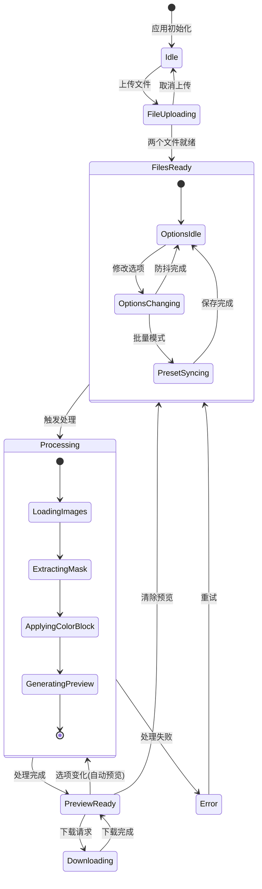
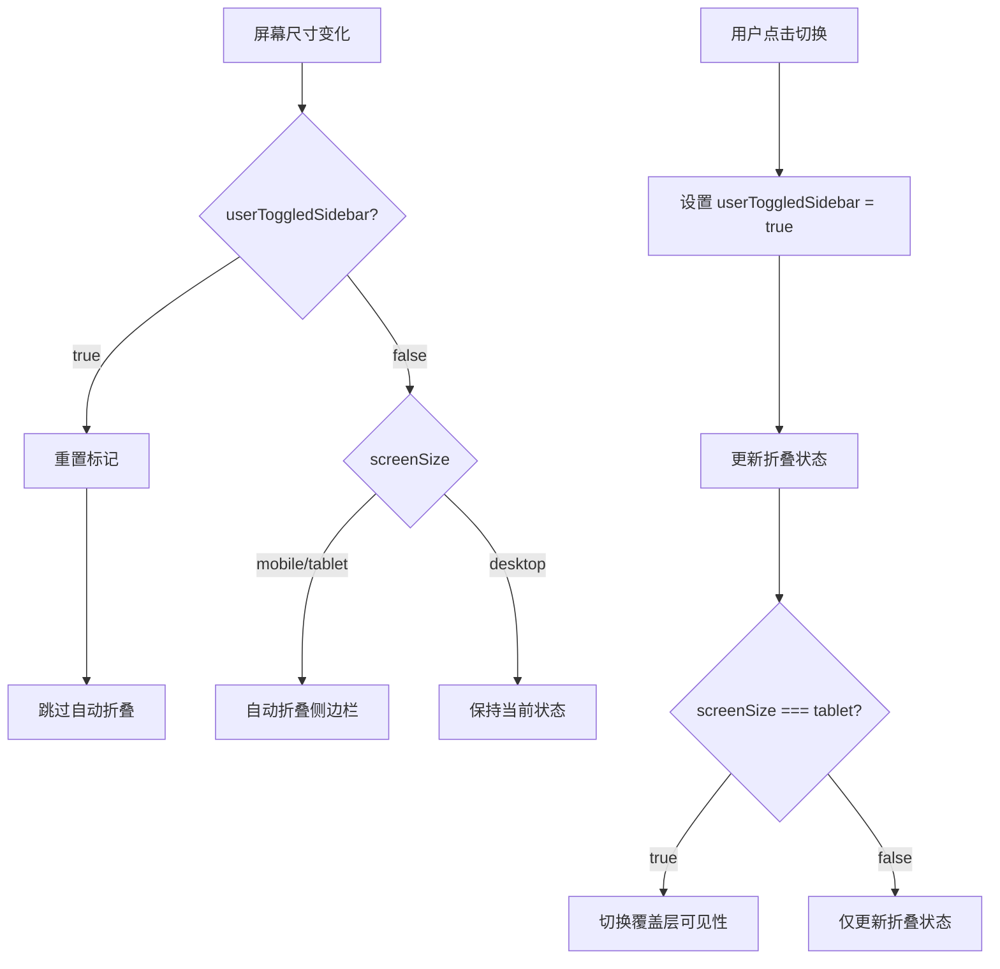
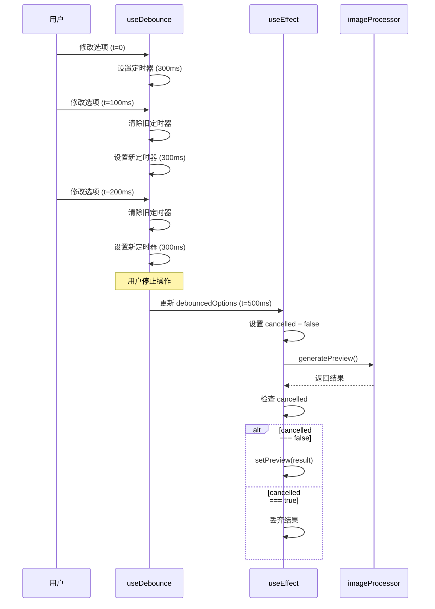
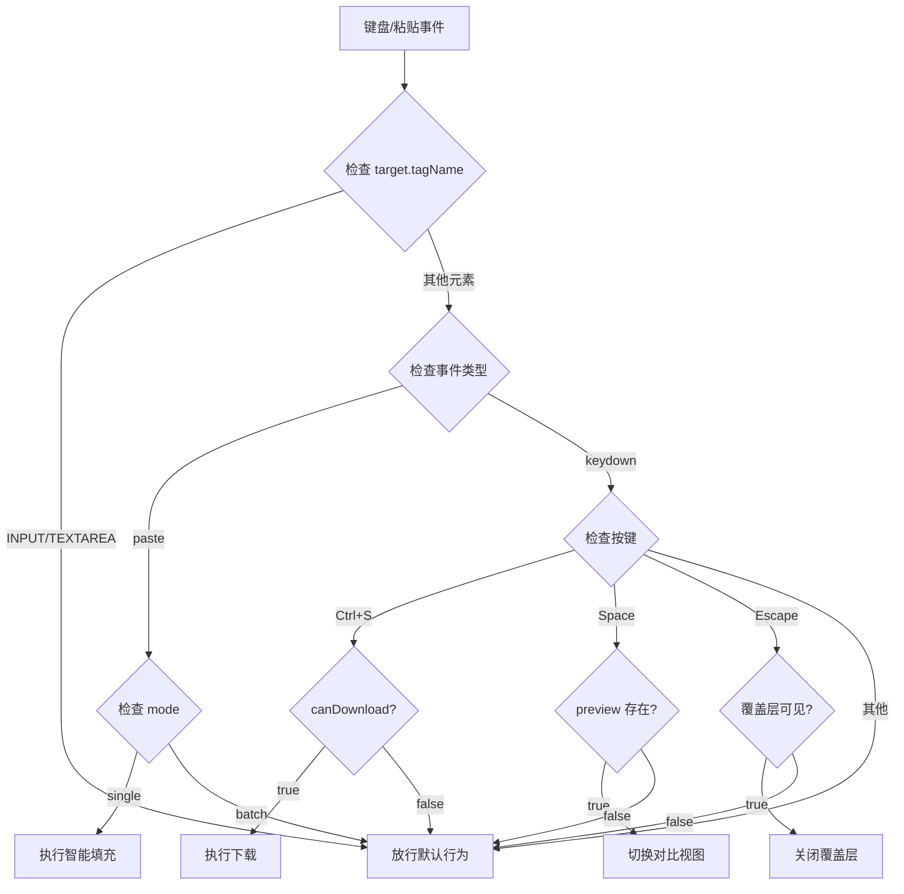
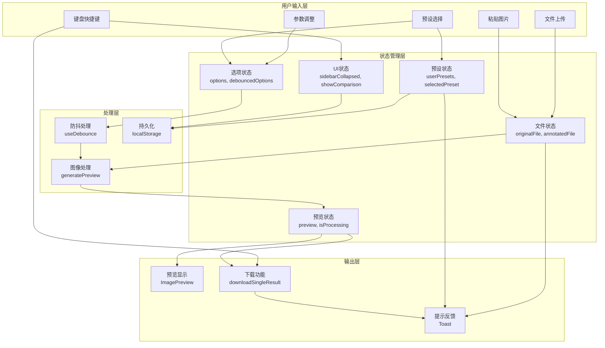

# 笔记图片叠加工具 - 复杂逻辑分析报告

## 概述

本报告深入分析笔记图片叠加工具的核心复杂逻辑，涵盖状态管理、响应式设计、实时预览机制以及全局事件处理四个关键领域。该应用采用 React 函数式组件与 Hooks 架构，通过精心设计的状态协调机制实现了流畅的用户体验。

---

## 1. 状态管理逻辑

### 1.1 多状态协调机制

应用的状态管理呈现出典型的"星型拓扑"结构，以 `App.tsx` 作为状态中枢，协调多个相互关联的状态变量。核心状态包括文件状态（`originalFile`、`annotatedFile`）、处理选项（`options`）、预设管理（`userPresets`、`selectedPreset`）以及预览结果（`preview`）。

状态之间存在明确的依赖关系：当用户选择预设时，系统自动将预设的 `options` 同步到当前处理选项；当处理选项变化时，若启用了自动预览，则触发图像处理流程生成新的预览结果。这种级联更新机制通过 React 的 `useEffect` 钩子实现，确保状态变化能够正确传播。

```typescript
// 状态初始化采用惰性计算模式
const [initialPresetState] = useState<{
  selectedPreset: string | null;
  options: ProcessingOptions;
}>(() => {
  const persisted = readPersistedPreset();
  const loadedPresets = loadUserPresets();
  // 优先级：持久化值 > 默认预设
  if (persisted === null) {
    return { selectedPreset: null, options: loadedPresets[0]?.options ?? presets[0].options };
  }
  // ...
});
```

### 1.2 预设与选项的同步机制

预设系统采用"双向绑定"策略：选择预设时，预设的选项值覆盖当前选项；修改选项时，若当前有选中的预设，则自动更新该预设的配置。这种设计在批量模式下尤为重要，确保用户的参数调整能够持久化保存。

```typescript
// 批量模式下的自动保存逻辑
const handleBatchOptionChange = useCallback((newOptions: ProcessingOptions) => {
  setOptions(newOptions);
  if (selectedPreset) {
    setUserPresets(prev => updateUserPreset(selectedPreset, newOptions, prev));
  }
}, [selectedPreset]);
```

该机制的设计权衡在于：牺牲了"临时修改"的灵活性，换取了"所见即所得"的一致性体验。用户在批量模式下的任何参数调整都会立即反映到预设中，避免了"忘记保存"导致的配置丢失问题。

### 1.3 状态流转图



---

## 2. 响应式设计逻辑

### 2.1 useScreenSize Hook 实现

`useScreenSize` 钩子采用 CSS Media Query API 实现屏幕尺寸检测，定义了三个断点：mobile（< 768px）、tablet（768px - 1024px）、desktop（>= 1024px）。该实现的关键设计决策是使用 `matchMedia` 而非 `resize` 事件监听，这带来了显著的性能优势——浏览器仅在断点边界触发回调，而非每次窗口尺寸变化都执行。

```typescript
function useScreenSize(): ScreenSize {
  const [screenSize, setScreenSize] = useState<ScreenSize>(() => {
    if (typeof window === 'undefined') return 'desktop';
    const width = window.innerWidth;
    if (width < 768) return 'mobile';
    if (width < 1024) return 'tablet';
    return 'desktop';
  });

  useEffect(() => {
    const mediaQueryDesktop = window.matchMedia('(min-width: 1024px)');
    const mediaQueryTablet = window.matchMedia('(min-width: 768px)');

    const updateScreenSize = () => {
      if (mediaQueryDesktop.matches) {
        setScreenSize('desktop');
      } else if (mediaQueryTablet.matches) {
        setScreenSize('tablet');
      } else {
        setScreenSize('mobile');
      }
    };

    mediaQueryDesktop.addEventListener('change', updateScreenSize);
    mediaQueryTablet.addEventListener('change', updateScreenSize);

    return () => {
      mediaQueryDesktop.removeEventListener('change', updateScreenSize);
      mediaQueryTablet.removeEventListener('change', updateScreenSize);
    };
  }, []);

  return screenSize;
}
```

初始状态计算采用惰性初始化模式，在服务端渲染场景下默认返回 `desktop`，确保了 SSR 兼容性。

### 2.2 侧边栏自动折叠逻辑

侧边栏的折叠行为涉及三个状态变量的协调：`sidebarCollapsed`（折叠状态）、`sidebarOverlayVisible`（覆盖层可见性）以及 `userToggledSidebar`（用户手动切换标记）。

自动折叠逻辑的核心挑战在于区分"系统触发"与"用户触发"的状态变化。当屏幕尺寸从 desktop 切换到 tablet/mobile 时，系统应自动折叠侧边栏；但如果用户刚刚手动展开了侧边栏，则不应覆盖用户的意图。

```typescript
// 用户意图追踪
const userToggledSidebar = useRef(false);

// 响应式自动折叠
useEffect(() => {
  // 如果用户刚手动切换过，跳过本次自动折叠
  if (userToggledSidebar.current) {
    userToggledSidebar.current = false;
    return;
  }

  // 在移动端和平板端自动折叠
  if (screenSize === 'mobile' || screenSize === 'tablet') {
    setSidebarCollapsed(true);
    setSidebarOverlayVisible(false);
  }
}, [screenSize]);

// 用户手动切换时设置标记
const handleSidebarCollapsedChange = useCallback((collapsed: boolean) => {
  userToggledSidebar.current = true;
  setSidebarCollapsed(collapsed);

  if (screenSize === 'tablet') {
    setSidebarOverlayVisible(!collapsed);
  }
}, [screenSize]);
```

### 2.3 冲突处理策略

该设计采用"用户优先"原则：`userToggledSidebar` 作为一次性标记，在用户手动操作后阻止下一次自动折叠。标记在 `useEffect` 执行后立即重置，确保后续的屏幕尺寸变化仍能触发自动折叠。

这种设计的权衡在于：用户手动展开侧边栏后，如果立即调整窗口大小，侧边栏会保持展开状态；但如果用户在展开后进行了其他操作（触发了 `screenSize` 的 `useEffect`），则后续的窗口调整会恢复自动折叠行为。这是一个合理的折中方案，在大多数使用场景下提供了符合直觉的交互体验。



---

## 3. 实时预览逻辑

### 3.1 useDebounce Hook 防抖机制

实时预览功能的核心挑战是平衡响应速度与计算资源消耗。图像处理是计算密集型操作，频繁触发会导致界面卡顿。`useDebounce` 钩子通过延迟执行策略解决这一问题。

```typescript
function useDebounce<T>(value: T, delay: number): T {
  const [debouncedValue, setDebouncedValue] = useState<T>(value);

  useEffect(() => {
    const timer = setTimeout(() => setDebouncedValue(value), delay);
    return () => clearTimeout(timer);
  }, [value, delay]);

  return debouncedValue;
}

// 使用：300ms 防抖延迟
const debouncedOptions = useDebounce(options, 300);
```

该实现的关键在于 `useEffect` 的清理函数：每次 `value` 变化时，先清除上一个定时器，再设置新的定时器。只有当用户停止操作 300ms 后，`debouncedValue` 才会更新，从而触发图像处理。

### 3.2 useEffect 依赖管理

实时预览的 `useEffect` 依赖数组包含 `autoPreview`、`originalFile`、`annotatedFile` 和 `debouncedOptions`。这种设计确保了：

1. **文件变化立即响应**：上传新文件时无需等待防抖延迟
2. **选项变化防抖处理**：滑动调节参数时不会频繁触发处理
3. **开关控制**：`autoPreview` 为 false 时完全禁用自动处理

```typescript
useEffect(() => {
  // 跳过首次渲染
  if (isFirstRender.current) {
    isFirstRender.current = false;
    return;
  }
  
  if (!autoPreview || !originalFile || !annotatedFile) return;
  
  let cancelled = false;
  
  const processImages = async () => {
    setIsProcessing(true);
    try {
      const result = await generatePreview(originalFile, annotatedFile, debouncedOptions);
      if (!cancelled) {
        setPreview(result);
      }
    } catch (error) {
      console.error('Preview generation failed:', error);
    } finally {
      if (!cancelled) {
        setIsProcessing(false);
      }
    }
  };

  processImages();

  return () => {
    cancelled = true;
  };
}, [autoPreview, originalFile, annotatedFile, debouncedOptions]);
```

### 3.3 首次渲染跳过逻辑

`isFirstRender` ref 的引入解决了一个微妙的问题：组件挂载时，`useEffect` 会立即执行一次。如果此时已有持久化的文件状态（例如从 localStorage 恢复），会触发不必要的图像处理。通过首次渲染跳过机制，确保只有用户主动操作后才触发处理。

```typescript
const isFirstRender = useRef(true);

useEffect(() => {
  if (isFirstRender.current) {
    isFirstRender.current = false;
    return;
  }
  // ... 实际处理逻辑
}, [/* dependencies */]);
```

### 3.4 竞态条件处理

异步操作的竞态条件是 React 应用中的常见陷阱。当用户快速连续修改参数时，可能出现后发起的请求先完成的情况。`cancelled` 标志变量配合清理函数，确保只有最新的处理结果会更新状态。



---

## 4. 全局事件处理

### 4.1 粘贴事件的智能填充逻辑

粘贴功能实现了"智能槽位填充"策略：系统根据当前文件状态自动决定粘贴图片的目标位置。这种设计显著提升了用户效率，避免了繁琐的手动选择操作。

```typescript
useEffect(() => {
  const handlePaste = (e: ClipboardEvent) => {
    // 输入框焦点检测：避免干扰正常文本输入
    const target = e.target as HTMLElement;
    if (target.tagName === 'INPUT' || target.tagName === 'TEXTAREA') {
      return;
    }

    // 模式限制：仅在单张处理模式下启用
    if (mode !== 'single') return;

    const items = e.clipboardData?.items;
    if (!items) return;

    for (const item of Array.from(items)) {
      if (item.type.startsWith('image/')) {
        const file = item.getAsFile();
        if (file) {
          e.preventDefault();
          setIsDrawerOpen(true);
          
          // 智能填充逻辑
          if (!originalFile) {
            setOriginalFile(file);
            showToast('已粘贴为原始图片', 'success');
          } else if (!annotatedFile) {
            setAnnotatedFile(file);
            showToast('已粘贴为 AI 标注图片', 'success');
          } else {
            // 两个槽位都已填充时，替换原图
            setOriginalFile(file);
            showToast('已替换原始图片', 'info');
          }
          break;
        }
      }
    }
  };

  document.addEventListener('paste', handlePaste);
  return () => document.removeEventListener('paste', handlePaste);
}, [mode, originalFile, annotatedFile, showToast]);
```

填充优先级设计遵循"工作流顺序"原则：原图 -> 标注图 -> 替换原图。这与用户的典型操作流程一致，减少了认知负担。

### 4.2 键盘快捷键处理

应用支持多个键盘快捷键，包括 Ctrl+S（下载）、Space（切换对比视图）、Escape（关闭覆盖层）。快捷键处理的关键挑战是避免与浏览器默认行为和输入框操作冲突。

```typescript
useEffect(() => {
  const handleKeyDown = (e: KeyboardEvent) => {
    // 输入框焦点检测
    const target = e.target as HTMLElement;
    if (target.tagName === 'INPUT' || target.tagName === 'TEXTAREA') {
      return;
    }

    // Ctrl+S: 下载
    if (e.ctrlKey && e.key === 's') {
      e.preventDefault();
      if (canDownload) {
        handleDownload();
      }
    }

    // Space: 切换对比视图
    if (e.key === ' ' && preview) {
      e.preventDefault();
      setShowComparison(prev => !prev);
    }

    // Escape: 关闭覆盖层
    if (e.key === 'Escape') {
      if (sidebarOverlayVisible) {
        setSidebarCollapsed(true);
        setSidebarOverlayVisible(false);
      }
    }
  };

  document.addEventListener('keydown', handleKeyDown);
  return () => document.removeEventListener('keydown', handleKeyDown);
}, [canDownload, handleDownload, preview, sidebarOverlayVisible]);
```

### 4.3 事件冲突避免策略

输入框焦点检测是事件冲突避免的核心机制。通过检查 `e.target.tagName`，系统能够区分用户是在进行文本输入还是执行全局操作。这种方法简单有效，但存在一定局限性——对于 `contenteditable` 元素或自定义输入组件可能无法正确识别。



---

## 5. 设计决策与权衡分析

### 5.1 状态管理策略

**决策**：采用组件内状态 + localStorage 持久化，而非引入 Redux/Zustand 等状态管理库。

**权衡**：
- **优势**：减少依赖、降低复杂度、适合中小规模应用
- **劣势**：状态分散、跨组件通信依赖 props drilling、难以实现时间旅行调试

**适用性评估**：对于当前应用规模，这是合理的选择。状态主要集中在 `App.tsx`，组件层级较浅，props drilling 的成本可控。

### 5.2 响应式实现方案

**决策**：使用 `matchMedia` API 而非 CSS-in-JS 或纯 CSS 媒体查询。

**权衡**：
- **优势**：JavaScript 层面获得屏幕尺寸信息，可用于条件渲染和逻辑分支
- **劣势**：需要手动管理事件监听器、可能与 CSS 媒体查询断点不一致

**适用性评估**：应用需要根据屏幕尺寸调整组件行为（如侧边栏折叠），纯 CSS 方案无法满足需求。

### 5.3 防抖策略

**决策**：300ms 固定防抖延迟。

**权衡**：
- **优势**：实现简单、行为可预测
- **劣势**：无法适应不同设备性能、可能对高性能设备造成不必要的延迟

**改进建议**：可考虑引入自适应防抖，根据上一次处理耗时动态调整延迟。

### 5.4 事件处理架构

**决策**：在 `App.tsx` 中集中处理全局事件。

**权衡**：
- **优势**：事件处理逻辑集中、易于维护和调试
- **劣势**：`App.tsx` 职责过重、事件处理与 UI 渲染耦合

**改进建议**：可考虑将事件处理逻辑抽取为自定义 Hook（如 `useGlobalKeyboard`、`useGlobalPaste`），提高代码组织性。

---

## 6. 跨章节关联点

1. **状态管理 <-> 图像处理**：`options` 状态变化触发 `imageProcessor.ts` 中的 `generatePreview` 函数，两者通过 `ProcessingOptions` 接口契约连接。

2. **响应式设计 <-> UI 组件**：`screenSize` 状态影响 `Sidebar`、`FloatingUploadButton` 等组件的渲染行为和布局策略。

3. **实时预览 <-> 性能优化**：防抖机制与图像处理算法的时间复杂度直接相关，`maskExpand` 参数的圆形膨胀算法是主要性能瓶颈。

4. **全局事件 <-> 用户体验**：粘贴智能填充与上传组件的状态同步，键盘快捷键与按钮操作的功能对等性。

5. **预设系统 <-> 持久化**：`localStorage` 的读写操作分散在多个位置，存在潜在的一致性风险。

---

## 附录：核心数据流图



---

*报告生成时间：2026-02-01 16:00:00*
*分析范围：App.tsx (871 行), imageProcessor.ts (524 行)*
