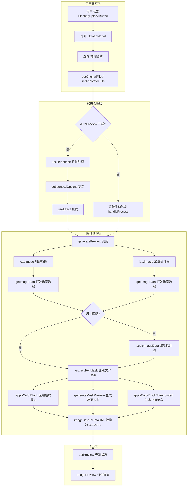
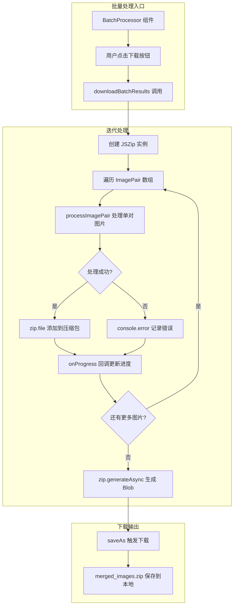
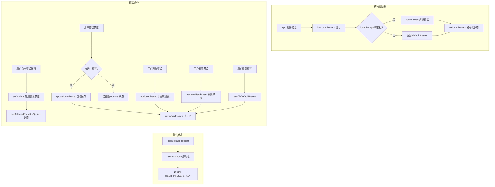

# 关键代码路径分析报告

## 概述

本报告对笔记图片叠加工具的三个核心代码路径进行深入分析：单张处理流程、批量处理流程以及预设管理流程。该应用采用 React 函数式组件架构，通过 Canvas API 实现像素级图像处理，并利用 localStorage 实现用户配置持久化。

---

## 1. 单张处理流程

### 1.1 流程概述

单张处理流程是应用的核心功能路径，涵盖从用户上传图片到最终预览显示的完整生命周期。该流程采用响应式设计，支持实时预览与手动处理两种模式，并通过防抖机制优化性能。

### 1.2 完整调用链

用户上传图片后，系统通过状态变更触发处理流程。当 `autoPreview` 开关启用时，`useEffect` 钩子监听 `originalFile`、`annotatedFile` 和 `debouncedOptions` 的变化，自动调用 `generatePreview` 函数执行图像处理。



### 1.3 generatePreview 函数详解

`generatePreview` 函数位于 `src/utils/imageProcessor.ts` 第 468-523 行，是单张处理的核心入口。该函数接收原始图片文件、标注图片文件和处理选项三个参数，返回包含五个 DataURL 的对象：原图、标注图、遮罩层、标注图+色块中间状态、最终结果。

函数执行流程如下：首先通过 `Promise.all` 并行加载两张图片，利用 `loadImage` 函数创建 `HTMLImageElement` 对象。随后调用 `getImageData` 将图片绘制到临时 Canvas 上并提取 `ImageData`。若两图尺寸不一致，则调用 `scaleImageData` 将标注图缩放至原图尺寸。

文字遮罩提取由 `extractTextMask` 函数完成（第 178-226 行）。该函数采用两阶段算法：第一阶段遍历所有像素，通过 `getLuminance` 计算亮度值，低于 `textThreshold` 阈值的像素被标记为文字区域；第二阶段执行圆形膨胀操作，以 `maskExpand` 为半径扩展遮罩边界，确保文字完全覆盖。

最终的色块叠加由 `applyColorBlock` 函数实现（第 233-269 行）。该函数遍历每个像素：对于遮罩区域内的像素，直接使用原图数据保持文字清晰；对于遮罩区域外的像素，将标注图与指定颜色按 `blockOpacity` 比例混合，实现半透明色块效果。

### 1.4 防抖机制实现

实时预览的防抖机制通过自定义 `useDebounce` Hook 实现（`App.tsx` 第 94-103 行）。该 Hook 接收原始值和延迟时间（默认 300ms），内部使用 `setTimeout` 延迟更新，并在依赖变化时清除前一个定时器，确保只有最后一次变更生效。

```typescript
// App.tsx 第 306 行
const debouncedOptions = useDebounce(options, 300);
```

防抖后的选项值被传入 `useEffect` 依赖数组（第 312-344 行），该 Effect 还包含取消标志 `cancelled` 用于处理竞态条件。当新的处理请求发起时，前一个未完成的请求会被标记为取消，其结果不会更新状态。

---

## 2. 批量处理流程

### 2.1 流程概述

批量处理流程允许用户同时处理多对图片，并将结果打包为 ZIP 文件下载。该流程由 `BatchProcessor` 组件协调，核心逻辑位于 `fileUtils.ts` 的 `downloadBatchResults` 函数。

### 2.2 downloadBatchResults 执行路径



### 2.3 核心函数分析

`downloadBatchResults` 函数位于 `src/utils/fileUtils.ts` 第 50-72 行。该函数接收三个参数：`ImagePair` 数组、处理选项和可选的进度回调函数。

函数首先创建 `JSZip` 实例，然后通过 `for` 循环顺序处理每对图片。每次迭代调用 `processImagePair` 获取处理后的 `Blob`，并以 `{baseName}_merged.png` 格式添加到压缩包。处理过程中，若发生错误则记录日志但不中断流程，确保其他图片正常处理。

```typescript
// fileUtils.ts 第 50-72 行
export async function downloadBatchResults(
  pairs: ImagePair[],
  options: ProcessingOptions = defaultProcessingOptions,
  onProgress?: (current: number, total: number) => void
): Promise<void> {
  const zip = new JSZip();
  const total = pairs.length;
  
  for (let i = 0; i < pairs.length; i++) {
    const pair = pairs[i];
    try {
      const blob = await processImagePair(pair.originalFile, pair.annotatedFile, options);
      const baseName = getBaseName(pair.originalName);
      zip.file(`${baseName}_merged.png`, blob);
      onProgress?.(i + 1, total);
    } catch (error) {
      console.error(`处理 ${pair.originalName} 时出错:`, error);
    }
  }
  
  const content = await zip.generateAsync({ type: 'blob' });
  saveAs(content, 'merged_images.zip');
}
```

### 2.4 进度回调机制

进度回调通过可选参数 `onProgress` 实现，该回调在每张图片处理完成后被调用，传入当前完成数量和总数量。`BatchProcessor` 组件可利用此回调更新 UI 进度条，为用户提供实时反馈。

### 2.5 ZIP 打包流程

ZIP 打包依赖 `jszip` 库。处理完成后，调用 `zip.generateAsync({ type: 'blob' })` 异步生成压缩包 Blob，随后通过 `file-saver` 库的 `saveAs` 函数触发浏览器下载，文件名固定为 `merged_images.zip`。

---

## 3. 预设管理流程

### 3.1 流程概述

预设管理系统允许用户保存、加载、更新和删除自定义处理参数配置。系统支持最多 4 个预设，并提供恢复默认预设功能。所有预设数据通过 localStorage 持久化存储。

### 3.2 预设数据流



### 3.3 预设管理函数详解

预设管理函数集中在 `src/utils/imageProcessor.ts` 第 90-138 行。

**loadUserPresets**（第 90-99 行）：从 localStorage 读取预设数据，使用 `USER_PRESETS_KEY`（值为 `'note-image-overlay.userPresets'`）作为存储键。若读取失败或数据不存在，返回 `defaultPresets` 的副本。

**saveUserPresets**（第 101-105 行）：将预设数组序列化为 JSON 并存储到 localStorage。存储前会截断数组至 `MAX_PRESETS`（值为 4）以限制存储空间。

**addUserPreset**（第 107-120 行）：创建新预设时，首先检查是否达到上限。新预设的 ID 使用时间戳生成（`preset-${Date.now()}`），描述固定为"自定义预设"。创建后立即调用 `saveUserPresets` 持久化。

**updateUserPreset**（第 128-132 行）：通过 `map` 遍历预设数组，找到匹配 ID 的预设并更新其 `options` 属性，保持其他属性不变。

**resetToDefaultPresets**（第 134-138 行）：创建 `defaultPresets` 的副本并保存，用于恢复出厂设置。

### 3.4 localStorage 持久化机制

应用使用两个 localStorage 键存储用户偏好：

| 键名 | 用途 | 位置 |
|------|------|------|
| `note-image-overlay.userPresets` | 用户预设数组 | imageProcessor.ts |
| `note-image-overlay.sidebarCollapsed` | 侧边栏折叠状态 | App.tsx |
| `note-image-overlay.selectedPreset` | 当前选中预设 ID | App.tsx |

`App.tsx` 中通过 `useEffect` 监听状态变化并自动同步到 localStorage（第 286-300 行）。读取时使用 `readPersistedCollapsed` 和 `readPersistedPreset` 辅助函数（第 70-91 行），这些函数包含完整的错误处理和类型验证逻辑。

### 3.5 批量模式下的预设自动保存

在批量处理模式下，当用户选中某个预设并修改参数时，系统会自动将变更保存到该预设。此逻辑由 `handleBatchOptionChange` 回调实现（第 198-203 行）：

```typescript
const handleBatchOptionChange = useCallback((newOptions: ProcessingOptions) => {
  setOptions(newOptions);
  if (selectedPreset) {
    setUserPresets(prev => updateUserPreset(selectedPreset, newOptions, prev));
  }
}, [selectedPreset]);
```

---

## 4. 关键技术要点总结

### 4.1 性能优化策略

- **防抖处理**：300ms 延迟防止频繁触发图像处理
- **竞态条件处理**：使用 `cancelled` 标志避免过期结果覆盖最新状态
- **并行加载**：`Promise.all` 同时加载原图和标注图
- **首次渲染跳过**：`isFirstRender` ref 避免初始化时的无效处理

### 4.2 错误处理机制

- **批量处理容错**：单张图片处理失败不影响其他图片
- **localStorage 容错**：读写操作均包含 try-catch 保护
- **类型验证**：持久化数据读取时进行类型检查

### 4.3 用户体验设计

- **实时预览**：参数变更即时反馈
- **进度反馈**：批量处理提供进度回调
- **快捷键支持**：Ctrl+S 下载、Space 切换视图
- **粘贴上传**：支持直接粘贴图片

---

## 5. 文件位置索引

| 功能模块 | 文件路径 | 行号范围 |
|----------|----------|----------|
| 主应用组件 | `src/App.tsx` | 1-871 |
| useDebounce Hook | `src/App.tsx` | 94-103 |
| 实时预览 Effect | `src/App.tsx` | 312-344 |
| 预设管理回调 | `src/App.tsx` | 175-203 |
| 图像处理核心 | `src/utils/imageProcessor.ts` | 1-524 |
| generatePreview | `src/utils/imageProcessor.ts` | 468-523 |
| extractTextMask | `src/utils/imageProcessor.ts` | 178-226 |
| applyColorBlock | `src/utils/imageProcessor.ts` | 233-269 |
| 预设管理函数 | `src/utils/imageProcessor.ts` | 90-138 |
| 文件工具 | `src/utils/fileUtils.ts` | 1-91 |
| downloadBatchResults | `src/utils/fileUtils.ts` | 50-72 |
